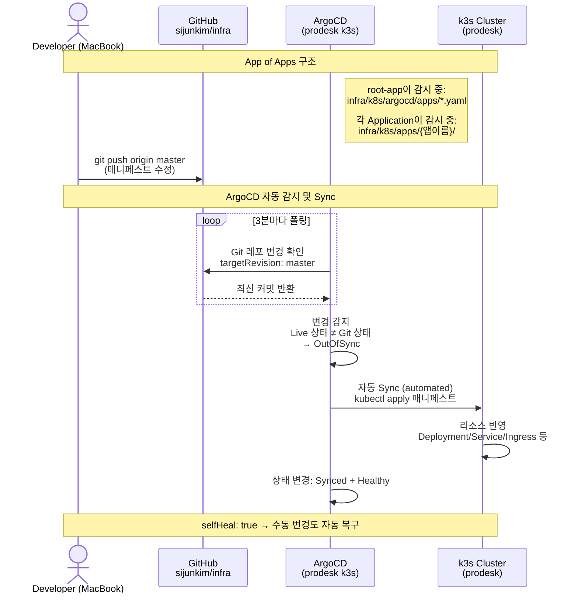
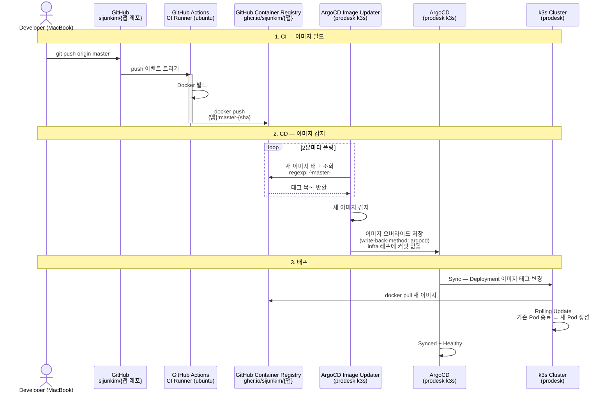

# GitOps Pipeline

## Overview

infra 레포는 ArgoCD App of Apps 패턴으로 prodesk k3s 클러스터의 모든 배포를 관리한다.
변경 경로는 두 가지로 나뉜다:

1. **인프라 변경** — infra 레포 push → ArgoCD가 매니페스트 변경 감지 → 자동 Sync
2. **앱 코드 변경** — 앱 레포 push → CI가 이미지 빌드 → Image Updater가 감지 → ArgoCD Sync

## 1. 인프라 변경 흐름

Deployment 리소스 조정, 인그레스 추가, 서비스 변경 등 k8s 매니페스트 수정 시.



### 핵심 동작 원리

ArgoCD는 prodesk k3s 내부에서 실행되며 **3분마다 Git 레포를 폴링**한다.
infra 레포에 push가 발생하면:

1. ArgoCD가 Git의 매니페스트와 클러스터의 Live 상태를 비교
2. 차이가 있으면 **OutOfSync** 상태로 전환
3. `syncPolicy.automated`가 설정되어 있으므로 **자동으로 kubectl apply** 실행
4. 클러스터에 변경 반영 후 **Synced + Healthy** 상태로 전환

`selfHeal: true` 설정으로, 누군가 kubectl로 직접 수정해도 Git 상태로 자동 복구된다.

## 2. 앱 코드 변경 흐름

비즈니스 로직 수정, 버그 수정 등 앱 소스 코드 변경 시.



### write-back-method: argocd

Image Updater가 새 이미지를 감지해도 **infra 레포에 커밋을 남기지 않는다.**
대신 ArgoCD 내부에 이미지 오버라이드를 저장한다:

```
infra 레포 (Git):     image: ghcr.io/sijunkim/naver-news-spring:master-placeholder
ArgoCD 오버라이드:     image: ghcr.io/sijunkim/naver-news-spring:master-484af0a  ← 실제 배포
```

이 덕분에:
- 앱 코드 push 시 infra 레포에 불필요한 커밋이 쌓이지 않음
- infra 레포는 인프라 변경 이력만 깔끔하게 유지됨

## App of Apps 구조

```
root-app (ArgoCD Application)
│  감시: infra/k8s/argocd/apps/
│
├── naver-news (Application)
│   감시: infra/k8s/apps/naver-news/
│   Image Updater: ghcr.io/sijunkim/naver-news-spring:master-*
│
├── friend-app (Application)
│   감시: infra/k8s/apps/friend-app/
│   Image Updater: ghcr.io/sijunkim/friend-app:master-*
│
└── mysql (Application)
    감시: infra/k8s/apps/mysql/
```

새 앱을 추가하려면:
1. `k8s/apps/{앱이름}/deployment.yaml` 작성
2. `k8s/argocd/apps/{앱이름}.yaml` 작성
3. git push → root-app이 자동 감지 → 새 Application 생성

## Component Details

| 구성 요소 | 위치 | 역할 |
|-----------|------|------|
| **root-app** | ArgoCD (prodesk) | `k8s/argocd/apps/` 감시, 하위 Application 자동 생성/삭제 |
| **ArgoCD** | prodesk k3s (argocd 네임스페이스) | Git 매니페스트 기반 배포 관리, 3분 폴링 |
| **Image Updater** | prodesk k3s (argocd 네임스페이스) | GHCR 2분 폴링, 새 이미지 감지 시 ArgoCD 오버라이드 |
| **Traefik** | prodesk k3s (kube-system) | HTTPS 인그레스, Let's Encrypt, IP 화이트리스트 |
| **k3s** | prodesk (192.168.0.46) | 컨테이너 실행 환경 |
| **GHCR** | ghcr.io/sijunkim/* | Docker 이미지 저장소 |

## Key Files

| 파일 | 용도 |
|------|------|
| `k8s/root-app.yaml` | App of Apps 루트 (최초 1회 kubectl apply) |
| `k8s/argocd/apps/*.yaml` | 각 앱의 ArgoCD Application 정의 |
| `k8s/apps/{앱}/deployment.yaml` | Deployment + Service 매니페스트 |
| `k8s/apps/{앱}/kustomization.yaml` | Kustomize 설정 (Image Updater 연동용) |
| `k8s/traefik/helmchartconfig.yaml` | Traefik ACME + HTTPS + externalTrafficPolicy |
| `k8s/argocd/ingress.yaml` | ArgoCD IngressRoute + IP 화이트리스트 |
| `k8s/services/*.yaml` | 공유 인프라 서비스 (Redis Endpoints 등) |
