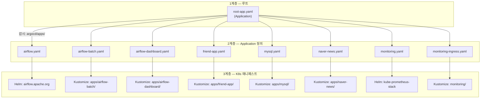
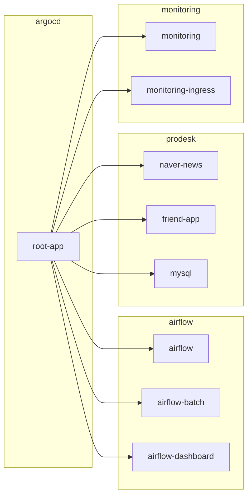

# k8s 디렉토리 구조

## 전체 구조

```
k8s/
├── root-app.yaml                    ← App of Apps 루트 (최초 1회 수동 apply)
│
├── argocd/                          ← ArgoCD 관련 설정
│   ├── apps/                        ← Application 정의 (root-app이 감시)
│   │   ├── airflow.yaml
│   │   ├── airflow-batch.yaml
│   │   ├── airflow-dashboard.yaml
│   │   ├── friend-app.yaml
│   │   ├── mysql.yaml
│   │   ├── naver-news.yaml
│   │   ├── monitoring.yaml
│   │   ├── monitoring-ingress.yaml
│   │   └── image-updater.yaml
│   └── ingress.yaml                 ← ArgoCD UI IngressRoute (수동 apply)
│
├── apps/                            ← 실제 K8s 매니페스트 (각 Application이 감시)
│   ├── airflow-batch/
│   ├── airflow-dashboard/
│   ├── friend-app/
│   ├── mysql/
│   ├── naver-news/
│   └── friend-external.yaml         ← 외부 서비스 라우팅 (수동 apply)
│
├── airflow/                         ← Helm values
│   └── values-airflow.yaml
│
├── monitoring/                      ← 모니터링 Ingress + 인증
│   └── ingress.yaml
│
├── services/                        ← 클러스터 외부 서비스 Endpoints (수동 apply)
│   └── redis.yaml
│
└── traefik/                         ← Traefik 설정 (수동 apply)
    └── helmchartconfig.yaml
```

## 3계층 구조

App of Apps 패턴은 3계층으로 동작한다.



| 계층 | 위치 | 역할 |
|------|------|------|
| 1계층 | `root-app.yaml` | `argocd/apps/` 디렉토리를 감시하여 하위 Application을 자동 생성/삭제 |
| 2계층 | `argocd/apps/*.yaml` | 각 앱의 소스(Helm 또는 Kustomize 경로)와 배포 대상 네임스페이스 정의 |
| 3계층 | `apps/*/`, Helm 차트 | Deployment, Service, ConfigMap 등 실제 K8s 리소스 |

**새 앱 추가 시 2계층에 파일 하나만 추가하면 root-app이 자동으로 감지한다.**

## Application 유형

### Kustomize 기반 (infra 레포 내 매니페스트)

`argocd/apps/` 의 Application이 `apps/{앱이름}/` 경로를 바라본다. ArgoCD는 해당 디렉토리의 `kustomization.yaml`을 빌드하여 배포한다.

```yaml
# argocd/apps/naver-news.yaml (2계층)
spec:
  source:
    repoURL: https://github.com/sijunkim/infra.git
    path: k8s/apps/naver-news          # ← 3계층 경로
```

앱 디렉토리 내 파일 구성은 용도에 따라 다르다:

<details>
<summary>앱별 파일 구성 비교</summary>

| 파일 | airflow-batch | airflow-dashboard | friend-app | mysql | naver-news |
|------|:---:|:---:|:---:|:---:|:---:|
| deployment.yaml | | O | O | O | O |
| service.yaml | | O | O | O | O |
| ingress.yaml | O | O | | | |
| configmap.yaml | O | | | | O |
| pv.yaml / pvc.yaml | O (pvc) | | | O (pv+pvc) | |
| secret.enc.yaml | O | | | O | O |
| secret-generator.yaml | O | | | O | O |
| kustomization.yaml | O | O | O | O | O |

</details>

### Helm 기반 (외부 차트)

외부 Helm 차트를 직접 참조한다. values는 인라인 또는 infra 레포 내 파일로 제공한다.

```yaml
# argocd/apps/airflow.yaml — 외부 values 파일 참조
spec:
  sources:
    - repoURL: https://airflow.apache.org       # Helm 차트
      chart: airflow
      helm:
        valueFiles:
          - $values/k8s/airflow/values-airflow.yaml
    - repoURL: https://github.com/sijunkim/infra.git
      ref: values                                # $values 참조용
```

```yaml
# argocd/apps/monitoring.yaml — 인라인 values
spec:
  source:
    repoURL: https://prometheus-community.github.io/helm-charts
    chart: kube-prometheus-stack
    helm:
      valuesObject:
        grafana:
          persistence:
            enabled: true
        # ...
```

## Secret 관리 (SOPS + KSOPS)

> 상세 설정 방법은 [sops-setup.md](./sops-setup.md) 참고.

Secret이 필요한 앱(`mysql`, `naver-news`, `airflow-batch`)은 동일한 패턴을 사용한다:

```
apps/{앱}/
├── secret.enc.yaml          ← SOPS로 암호화된 Secret (Git에 커밋)
├── secret-generator.yaml    ← KSOPS generator 설정
└── kustomization.yaml       ← generators에 secret-generator 등록
```

```yaml
# kustomization.yaml
generators:
  - ./secret-generator.yaml    # Kustomize 빌드 시 KSOPS가 복호화

# secret-generator.yaml
apiVersion: viaduct.ai/v1
kind: ksops
files:
  - ./secret.enc.yaml          # 이 파일을 복호화하여 Secret 리소스 생성
```

ArgoCD repo-server가 Kustomize 빌드를 실행할 때 KSOPS 플러그인이 `secret.enc.yaml`을 age 키로 복호화하여 K8s Secret을 생성한다.

## Ingress 구조 (Traefik)

모든 외부 접근은 Traefik IngressRoute를 통해 HTTPS로 서비스된다.

| 도메인 | 리소스 위치 | 대상 서비스 |
|--------|-------------|-------------|
| `argocd.kimsijun.com` | `argocd/ingress.yaml` | argocd-server:80 |
| `airflow.kimsijun.com` | `apps/airflow-batch/ingress.yaml` | airflow-webserver:8080 |
| `airflow-dashboard.kimsijun.com` | `apps/airflow-dashboard/ingress.yaml` | airflow-dashboard:3000 |
| `friend.kimsijun.com` | `apps/friend-external.yaml` | friend-external:3000 |
| `grafana.kimsijun.com` | `monitoring/ingress.yaml` | monitoring-grafana:80 |
| `prometheus.kimsijun.com` | `monitoring/ingress.yaml` | prometheus:9090 (Basic Auth) |

Traefik 자체는 k3s 기본 내장이며, `traefik/helmchartconfig.yaml`에서 Let's Encrypt ACME + HTTPS 리다이렉트를 설정한다.

## Image Updater 연동

`argocd/apps/` 내 Application 중 Image Updater annotation이 붙은 앱은 새 컨테이너 이미지가 자동 배포된다.

> 상세 흐름은 [gitops-pipeline.md](./gitops-pipeline.md)의 "앱 코드 변경 흐름" 참고.

| 앱 | 이미지 | 태그 필터 |
|----|--------|-----------|
| naver-news | `ghcr.io/sijunkim/naver-news-spring` | `^master-` |
| friend-app | `ghcr.io/sijunkim/friend-app` | `^master-` |
| airflow-dashboard | `ghcr.io/sijunkim/airflow-dashboard` | `^master-` |

annotation 예시:

```yaml
metadata:
  annotations:
    argocd-image-updater.argoproj.io/image-list: app=ghcr.io/sijunkim/naver-news-spring
    argocd-image-updater.argoproj.io/app.update-strategy: newest-build
    argocd-image-updater.argoproj.io/app.allow-tags: regexp:^master-
    argocd-image-updater.argoproj.io/write-back-method: argocd
```

## 수동 apply가 필요한 리소스

ArgoCD가 관리하지 않는 리소스는 최초 1회 수동으로 apply해야 한다.

| 파일 | 이유 |
|------|------|
| `root-app.yaml` | ArgoCD 자체를 부트스트랩하는 진입점 |
| `argocd/ingress.yaml` | argocd 네임스페이스에 직접 배포 필요 |
| `traefik/helmchartconfig.yaml` | kube-system 네임스페이스, k3s HelmChartConfig CRD |
| `services/redis.yaml` | ArgoCD Application으로 등록되지 않은 공유 서비스 |
| `apps/friend-external.yaml` | ArgoCD Application으로 등록되지 않은 외부 라우팅 |

> [!TIP]
> 수동 apply 리소스를 줄이려면 `argocd/apps/`에 Application을 추가하여 ArgoCD 관리로 전환할 수 있다.

## 네임스페이스 배포 맵



| 네임스페이스 | 앱 | 비고 |
|-------------|-----|------|
| `argocd` | root-app | Application 정의만 존재 |
| `airflow` | airflow, airflow-batch, airflow-dashboard | Helm + Kustomize 혼합 |
| `prodesk` | naver-news, friend-app, mysql | 애플리케이션 + DB |
| `monitoring` | monitoring, monitoring-ingress | Helm + IngressRoute |
